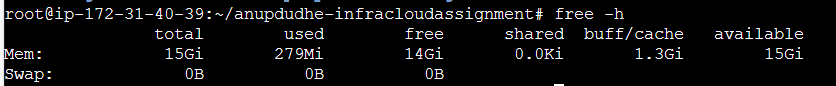
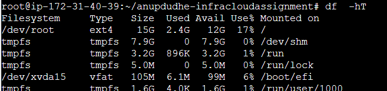
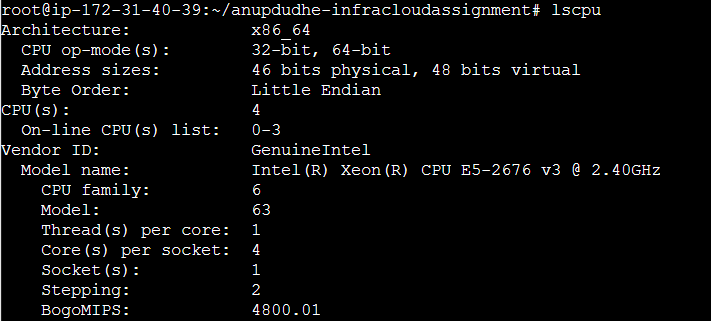
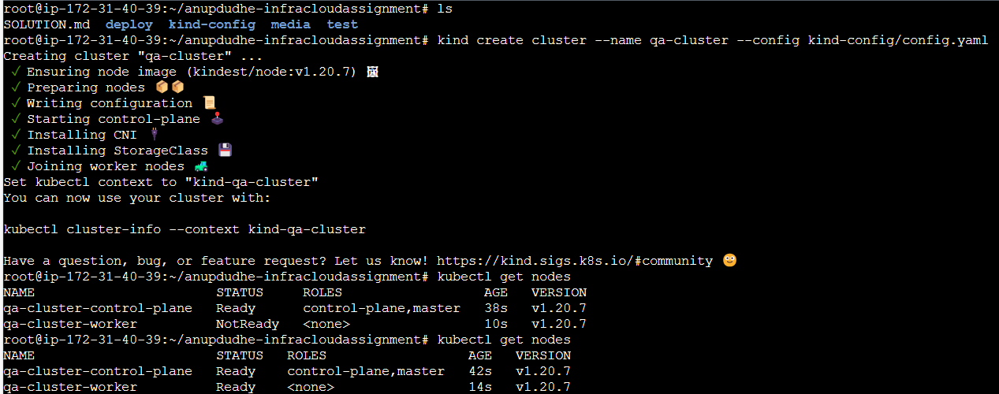
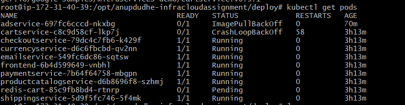
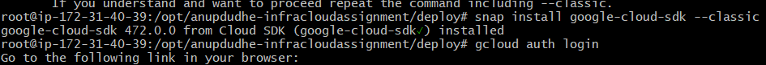

*Procedure to deploy E-commerce website Online Boutique which is a microservice application with 11 microservices , which are to be deployed kubernetes (k8s) cluster using deployment and service objects.*

Note - This project is divided in multiple steps , each step being named
as step 1,step 2 and so on. 

**step 1**

Configuration of my current system is

Memory -



Storage -



CPU details -



linux debian used - Ubuntu

installing container runtime engine since we are using kind -

we are usng docker as container runtime engine for this project

install docker engine following the link mentioned below
```
https://docs.docker.com/engine/install/

```
install kubectl binary on system following the link mentioned below 

```
https://kubernetes.io/docs/tasks/tools/install-kubectl-linux/
```

install kind on system following the link mentioned below
```
https://kind.sigs.k8s.io/docs/user/quick-start/#installation
```

setting up worker node -




**Step 2**


how to resolve the error of crashloopbackoff for deployment cartsservice



